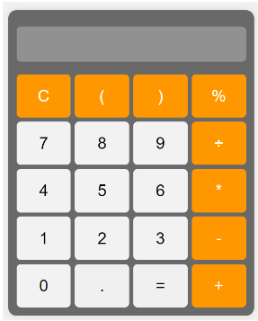
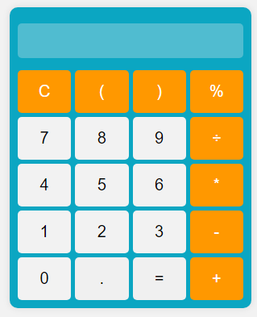

# Calculadora Web

# Descripción

Esta es una calculadora web básica que permite realizar operaciones matemáticas simples. 
La calculadora incluye funciones para sumar, restar, multiplicar y dividir, así como para manejar paréntesis y porcentajes. 
El diseño está estilizado con CSS y la funcionalidad se maneja a través de JavaScript.

## Vista del Modelo

Aquí puedes ver la imagen del modelo que se utilizó como referencia:

## Vista Codificada

A continuación, se muestra la imagen del resultado obtenido:

## Autor

Este ejercicio fue realizado por **Valeria Torrealba**.

